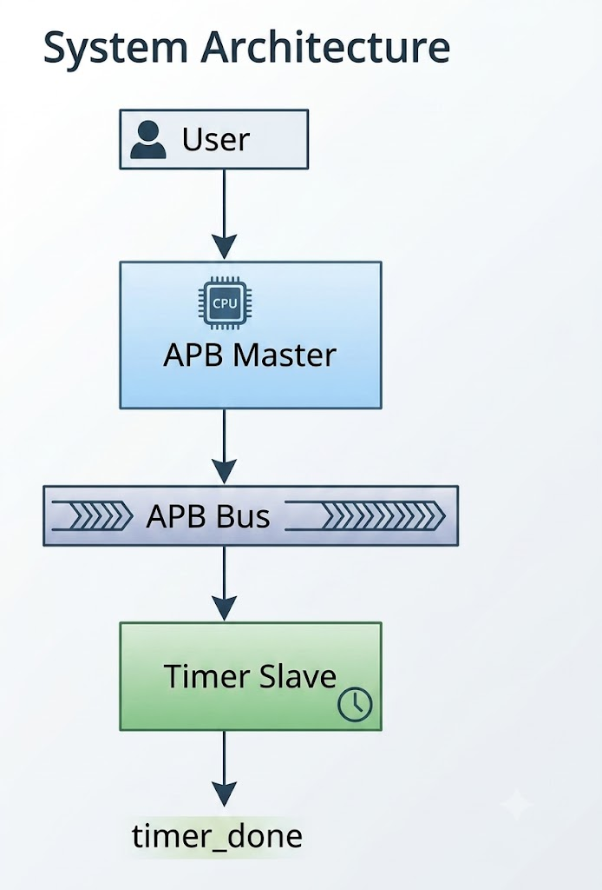
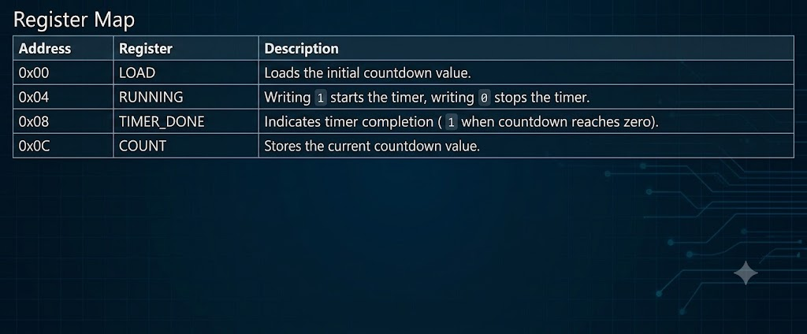

# APB-Based 8-Bit Countdown Timer IP

## Overview

This project implements an **8-bit Countdown Timer IP** using the **Advanced Peripheral Bus (APB)** protocol in Verilog HDL. The timer can be configured through APB register accesses by loading an initial count value, starting the timer, monitoring the current count and detecting timer completion.

The design was verified using **Verilator** and visualized using **GTKWave**.

---

## Features

* APB-compliant Master and Timer Slave
* 8-bit Programmable Countdown Timer
* Register-Based Configuration
* APB Read and Write Transactions
* Countdown Status Monitoring
* Functional Verification using Verilator

---

## System Architecture

---

## Register Map

                       
---

## Working Principle

1. Reset the system.
2. Write the desired countdown value to the **LOAD (0x00)** register.
3. Write **1** to the **RUNNING (0x04)** register to start the timer.
4. The countdown value is loaded into the **COUNT** register.
5. The **COUNT** register decrements every clock cycle.
6. When the count reaches zero:

   * `running` is cleared to **0**.
   * `timer_done` is asserted to **1**.
7. The current count and timer status can be read through the APB interface.

---

## APB Transaction Flow

### Write Operation

* Setup Phase (`PSEL = 1`, `PENABLE = 0`)
* Access Phase (`PENABLE = 1`)
* Data is written into the selected register.

### Read Operation

* Setup Phase
* Access Phase
* The slave returns the requested register value through `PRDATA`.

---

## Verification

The following functionality was successfully verified:

* ✔ Reset operation
* ✔ Write to **LOAD** register
* ✔ Write to **RUNNING** register
* ✔ Countdown operation
* ✔ Read **COUNT** register
* ✔ Read **TIMER_DONE** register
* ✔ Timer completion detection

---

## Tools Used

* Verilog HDL
* Verilator
* GTKWave

---

## Applications

* Embedded Systems
* FPGA Designs
* Microcontroller Peripherals
* System-on-Chip (SoC)
* Programmable Timers

---

## Future Enhancements

* Configurable Timer Width
* Auto-Reload Mode
* Interrupt Generation
* Prescaler Support
* Multiple Timer Instances

---

## Conclusion

This project demonstrates the design and verification of an APB-based 8-bit Countdown Timer IP using Verilog HDL. It highlights APB protocol implementation, FSM-based master design, register-based peripheral development and functional verification through simulation. The modular design makes the IP easy to integrate into larger FPGA and SoC-based systems.
